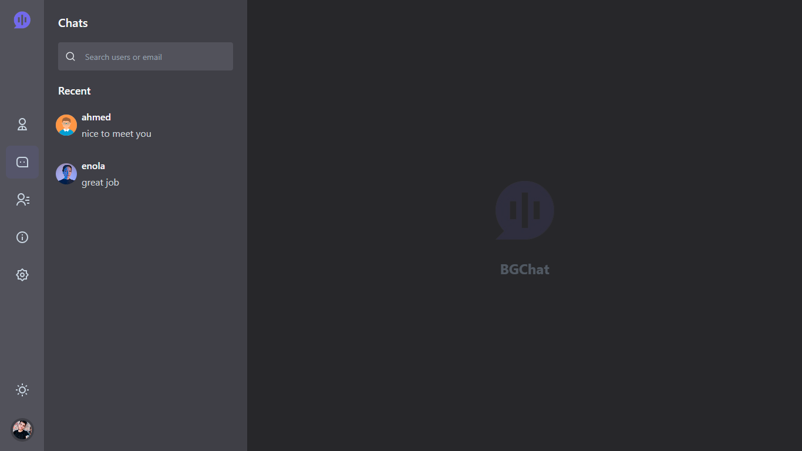

<h1 align="center">Real Time Chat app</h1>

<p align="center">A Full-Stack Real Time Chat App using MERN Stack && Socket.io</p>

## Features

<ul>
  <li>Register/Login</li>
  <li>Send and receive messages in real time</li>
  <li>Display online/offline status indicators </li>
  <li>Show typing indicators to let users know when someone is typing a message in the chat.</li>
  <li>Enable users to share files such as images</li>
  <li>Update your profile such as profile picture, username, bio</li>
  <li>Full Responsive</li>
  <li>Skeletons Loading</li>
</ul>



## Technologies

### Frontend

  <ul>
  <li>React.js</li>
  <li>TailwindCSS</li>
  <li>Redux ToolKit</li> 
  <li>TypeScript</li> 
  <li>react-hot-toast</li>
  <li>socket.io-client</li>
</ul>
<h3>Backend</h3>
<ul>
  <li>Node.js</li>
  <li>Express</li>
  <li>MongoDB</li>
  <li>jwt</li>
  <li>bcrypt</li> 
  <li>Socket.io</li> 
</ul>

## Setting up development environment

### Backend

## Installation

```bash
$ git clone https://github.com/bahaaghali000/full-stack-realtime-chat-app.git
```

```bash
$ cd backend
```

```bash
$ npm install
```

## Running the app

```bash
# development
$ npm start

```

### Frontend

First Installation

```bash
cd frontend
```

```bash
npm i
```

Second, run the development server:

```bash
npm run dev
```

### UI

taken from <a href="https://themesbrand.com/chatvia-tailwind/">ThemeForest</a>
